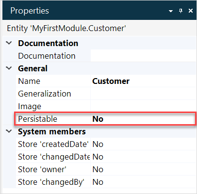

## 1 Introduction 

Entities in the domain model can be persistable and non-persistable.

Persistable entities can be stored in the database and retrieved later if necessary.

Non-persistable entities will not be stored in the database, they are stored in memory, and cannot be retrieved.   

To change persistability of an entity, do the following:

1. Open your domain model.

2. Select the entity and open its properties. 

3.  Set the **Persistable** setting to *Yes* or *No*. 

	

{}

Entities are created persistable by default. Persistable entities have a blue background, while non-persistable ones are colored orange. 

{}

This document describes the difference between persistable and non-persistable entities, and also explains the meaning of the related term *transient*.

## 2 Differences Between Persistable and Non-Persistable Entities

When an entity is persistable, a database table is created for the entity. When you commit an instance of such an entity, a row will be added to the table. Attribute and association information stored in this instance is saved in the database as well.

Performing a rollback on persistable auto-committed objects or objects with the state "NEW" deletes the row corresponding with this object from the database table for the associated entity. Otherwise, a rollback only reverts changes in memory since the last commit.

Non-persistable entities cannot be stored in the database and thus have no associated database table. Committing non-persistable entities only stores the current attribute values and association values in memory, which allows for a rollback to revert to those values.

## 3 Transient Entities

All objects associated with domain model entities are inherently transient when they are created in Mendix. In this context transient means they only exist in memory.

When an object is created, the database will not be accessed. The exception is when retrieving autonumber information when attributes of this type are present (autonumber attributes are only allowed for persistable entities). This means a transient object is eligible for garbage collection when not in use anymore.
